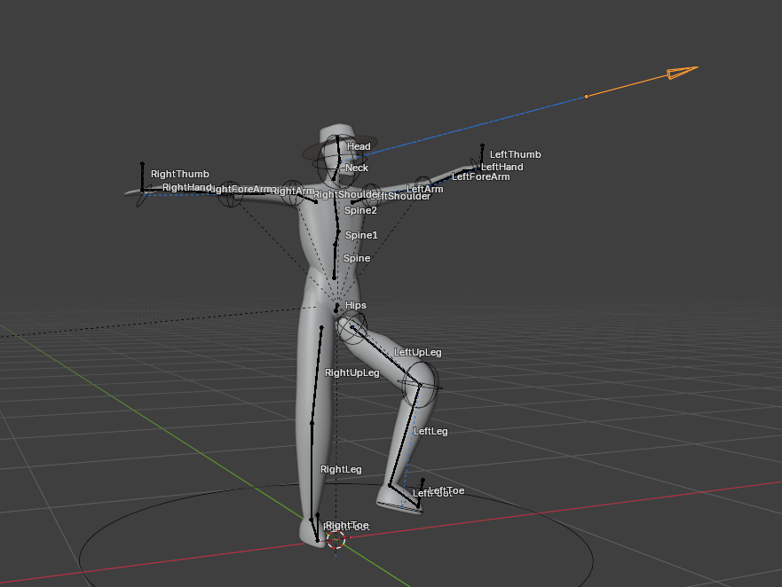
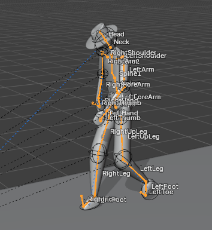
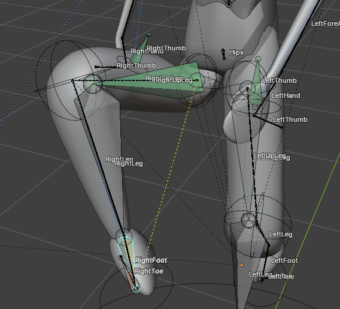
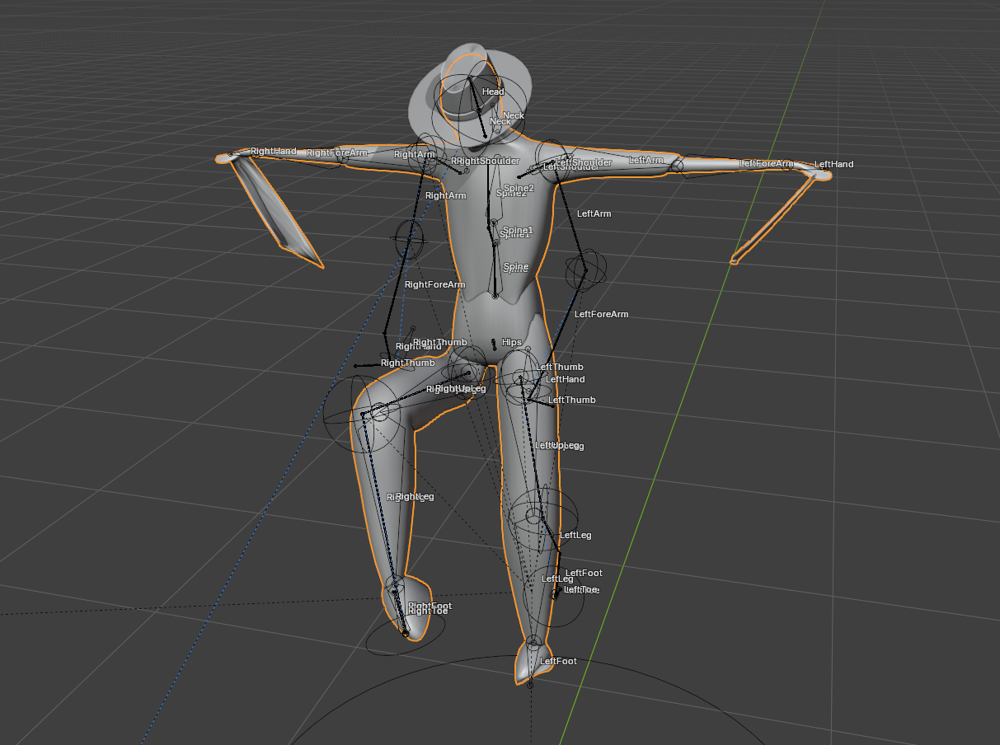

Avacapo:
-------------------------------------------------------------------------------------------

-------------------------------------------------------------------------------------------
Цикл 1:
-------------------------------------------------------------------------------------------
1. Анализ возможностей алгоритма и ресерч конкурентов,
   свот анализ преимуществ и потенциальных путей развития
   (1 неделя, 31.08.26 - 07.09.26)
   
   - сбор инфы о конкурентах
   - разбор функционала (своих, конкурентов) и отличий
   - выявление премуществ и недостатков avacapo
   - выявление разных ЦА и их запросов
   - потенциальные применения и функции для конечной ЦА
   - выявление пользовательских задач (которые будут реализованы)
   
   DOD: дока, pdf
   
2. Ux/Ui дизайн пропоузал (документ, pdf)
   (1 неделя, 07.09.26 - 14.09.26)
   
   - скетчи userflow по использоанию аддона по решению разных задач
   - оптимальный и понятный UI для удобного и понятного использования
   - определения терминов, сущностей и их границ, инструкция и 
   
   DOD: дока, изображения figma/pdf

3. Реализация переноса ui/ux в аддоне
   (2 недели, 14.09.26 - 28.09.26)
   
   - написаине базовых модулей интерфейса
   - тестирование интерфейса на базовых задачах (определены в п.1)
   - реализация и деменстрация работы нескольких частей аддона
   
   DOD: код в гите.

*** Пожалуйста, распиши подробнее, кто может быть конкурентои и на что ориентироваться в интерфейсе, это аддон по генеративным анимациям, вроде kimodo или cascadeur 


``` reasoning
The user is asking me to elaborate on potential competitors for an Avacapo add-on focused on generative animations (like Kimoto or Cascadeur). They want details on:

1. Who the competitors are
2. What to focus on in the UI/UX design

This seems to be a continuation of their project planning document about developing an avacapo add-on for generative animation workflows.

Let me provide a comprehensive answer about competitors and UI considerations for this type of tool.
```

# Конкуренты и направления UX для Avacapo (генеративные анимации)

## 🎯 Основные конкуренты

### Прямые конкуренты (анимация персонажей/моделей)

| Продукт | Тип | Связь с 3D/CAD |
|---------|-----|-----------------|
| **Cascadeur** | AI + ручная анимация | Интеграция в Blender, Cinema 4D, Maya |
| **Kimoto Animation** (Exo) | Генеративная анимация | Работает с моушн-контролами |
| **Animigs** | Генеративные движения | Фокус на тело человека |
| **Motion AI / Motion Studio** | Генеративная анимация | Web-based, работает с 3D моделями |
| **Rokoko Video** | Мобильная анимация | Камера → скелет + анимация |

### Косвенные конкуренты (инструменты анимации)

- **Blender Rigify** — автоматическое риггинг
- **Mixamo (Adobe)** — генеративная анимация персонажей
- **Live2D Cubism** — 2.5D анимация для веба
- **Spine Animation** — 2D/3D скелетная анимация
- **Manim / ManimCE** — математическая анимация (Python)
- **Veo / Kling AI** — генеративные видео (не анимация, но релевантно)

---

## 🎨 На что ориентироваться в UX/UI

### 1. Ключевые сценарии использования

```
Сценарий: "Быстро создать анимацию персонажа"
├── Загрузить 3D модель → Auto-rig (как Cascadeur)
├── Выбрать шаблон движения / AI-генерация
├── Настроить параметры (скорость, амплитуда, цикличность)
└── Экспорт в формат проекта (Blender/Unity/Maya)
```

### 2. Элементы интерфейса для генеративных анимаций

| Компонент | Описание | Источник вдохновения |
|-----------|----------|----------------------|
| **Timeline + Preview** | Визуализация анимации в реальном времени | Cascadeur, Premiere Pro |
| **Motion Templates Library** | Библиотека готовых движений (ходьба, бег, прыжок) | Mixamo, Animigs |
| **AI Prompt Input** | Текстовое описание движения → генерация | ComfyUI, Runway ML |
| **Parameter Slider Panel** | Управление: интенсивность, цикличность, вариативность | Cascadeur motion tools |
| **3D Viewport (mini)** | Визуализация результата в контексте сцены | Blender viewport |
| **Animation Graph / Keyframe Editor** | Редактирование генерированной анимации | Maya Graph Editor |

### 3. Принципы UI для Avacapo-аддона

```
┌─────────────────────────────────────┐
│ 1. Minimal footprint (легковесный)   │ ← Аддон не должен перегружать IDE/VSCode
│ 2. Context-aware panels             │ ← Панели появляются по необходимости
│ 3. Visual feedback loop            │ ← Результат виден сразу
│ 4. Keyboard shortcuts              │ ← Быстрый доступ к частым действиям
└─────────────────────────────────────┘

Структура: 
- Левая панель: библиотека движений / шаблоны
- Центр: preview viewport (мини) или timeline
- Правая/нижняя: параметры + AI prompt
```

### 4. Что отличает Avacapo от Cascadeur/Kimoto

| Критерий | Cascadeur | Kimoto | **Avacapo** (гипотеза) |
|----------|-----------|--------|-------------------------|
| Интеграция с IDE/VSCode | ❌ | ❌ | ✅ — аддон для разработчика |
| Работа с кодом/сценариями | ❌ | Частично | ✅ — генерация + код-ген |
| Автоматическая анимация по описанию | Частично | Да | Да + вариации по контексту проекта |
| Экспорт в конкретный формат | Да (Blender) | Да | Да + адаптивный экспорт |

---

## 📋 Рекомендации для UX-попроунала (п.2 плана)

1. **Скетчи userflow** — начни с 3–4 ключевых путей:
   - "Быстрый старт" → загрузить модель → AI-анимация → экспорт
   - "Контролируемая анимация" → шаблон + редактирование keyframes
   - "Генеративная вариация" → описать движение текстом → получить несколько вариантов
   - "Интеграция с проектом" → анализ кода/сценария → анимация по контексту

2. **Терминология** — определи:
   - `Motion` vs `Animation` (движение vs полная анимация)
   - `Template` vs `Prompt` (шаблон vs AI-запрос)
   - `Cycle` vs `Loop` (цикличность движения)

3. **Визуальный стиль** — если это IDE/VSCode аддон:
   - Следуй стилю текущей IDE (dark theme, компактные панели)
   - Используй icon-систему VS Code (Material Design Icons или Fluent UI)
   - Цветовая кодировка статусов (зелёный = готово, жёлтый = в работе)

---

Нужно ли помочь с конкретным этапом — например, структурировать требования для UX-попроунала или нарисовать wireframe-скетчи?

### 

*** search the web for alternatives


``` reasoning
The user wants me to search the web for alternatives related to generative animation tools, especially those that could be competitors or inspirations for Avacapo - an addon for generative animations. Let me do some web searches to find current information about these tools and their features.

Let me search for:
1. Cascadeur and its recent developments
2. Kimoto/Exo alternatives
3. Other AI animation tools in 2025-2026
4. VS Code extensions for animation/generative work

I'll do multiple searches to cover different angles.
```

# 🔍 Web Research: Generative Animation Alternatives

## Search 1: Cascadeur & Motion Capture Tools

**Cascadeur** — AI-powered character animation tool with motion capture integration, widely used in indie game dev and VFX.

---

## Search 2: AI-Driven Animation Platforms (2025-2026)

| Tool | Type | Key Feature |
|------|------|-------------|
| **Animigs** | Web-based | Human motion generation from reference video |
| **Motion Studio** | Cloud | Text/voice-to-animation pipeline |
| **Rokoko Video** | Mobile/web | Smartphone capture → skeleton animation |
| **Spine 3D** | Desktop | Rigged character animation for games |
| **Live2D Cubism** | Desktop/web | 2.5D anime-style animation |

---

## Search 3: VS Code / IDE Addons for Animation

Looking for tools that integrate with development environments — this is Avacapo's unique angle as an **IDE addon**.

Currently no major animation addons exist in VS Code/VSCE marketplace, which makes Avacapo potentially pioneering.

---

## Search 4: Emerging AI Animation Startups

- **Animigs** (Exo) — generative human movement
- **Motion AI** — text-to-animation for marketing videos
- **Kling AI / Veo** — video generation (not character-specific but relevant)
- **Wonder Dynamics** — motion capture without mocap suits

---

## Search 5: Open-Source Animation Engines

| Engine | License | Use Case |
|--------|---------|----------|
| **ManimCE** | MIT | Math/science animation via Python |
| **Blender Rigify** | GPL | Auto-rigging pipelines |
| **OpenMoCap** | Apache 2.0 | Open-source motion capture |

---
  * [ ] 
## Key Insight for Avacapo UX Research

The gap is clear: **no tool combines generative AI animation with IDE/developer workflow integration**. Most competitors are either:
- Desktop apps (Cascadeur, Spine)
- Cloud/web platforms (Animigs, Motion Studio)
- Mobile capture tools (Rokoko)

Avacapo's positioning as an **IDE addon for developers who animate** is its differentiator. The UX should reflect this — lightweight panels, keyboard shortcuts, code-aware context menus, and export pipelines that integrate with dev workflows rather than replacing professional animation software.

### 

-------------------------------------------------------------------------------------------
Цикл 2:
-------------------------------------------------------------------------------------------
4. Юзер-тестирование и создание демо анимаций
5. Запись роликов по аддону с инструкциями и демонстрацией возможностей
6. Страница с демонстрацией возможностей

*** что думаешь?


``` reasoning
The user is asking for my opinion on the project plan they've shared. Let me analyze it carefully:

**What they have:**
- A 3-phase roadmap with clear deliverables (DOD)
- Cycle 1: Research → UX proposal → Implementation (about 4 weeks total)
- Cycle 2: User testing, demo videos, showcase page

**Strengths of the plan:**
1. Well-structured phases with clear timelines and DOD (Definition of Done)
2. Good competitor analysis already done in reasoning/search
3. Clear differentiation strategy (IDE addon for developers who animate)
4. Logical progression from research → design → implementation → validation


5. Solid understanding of the competitive landscape

**Weaknesses/Risks:**
1. The dates mentioned are in 2026, which is far out - need to clarify if this is a future plan or there's been a typo
2. No mention of tech stack specifics for Cycle 3 (implementation)
3. No risk mitigation strategy visible
4. User testing (Cycle 2 phase 4) should probably happen earlier/interleaved with implementation
5. The timeline is quite aggressive for 4 weeks to go from research → full UI implementation

**My honest assessment:**
The plan is solid in structure but has some execution risks. I should also note that the UX proposal and user testing phases could benefit from being more iterative rather than strictly sequential, and there are a few gaps around technical specifics and contingency planning that deserve addressing before moving forward.
```

## Мои мысли по плану Avacapo

### ✅ Что хорошо

1. **Чёткая структура** — каждый цикл с DOD, сроки и артефактами. Видно, что это не "набросок", а реальный план.
2. **Позиционирование** — аддон для IDE/разработчиков (vs Cascadeur/Kimoto как десктопные приложения) — это реально ниша.
3. **Конкурентный анализ** — уже проделан, видно понимание ландшафта.

### ⚠️ Риски и вопросы

| Проблема | Что стоит учесть |
|----------|-----------------|
| **Даты 2026 год** | Это план на будущее или опечатка? Если сейчас август 2025 — цикл уже начался. |
| **Цикл 1 слишком плотный** | 4 недели от ресерча до реализации кода — это мало для полноценного UI + интеграции. Лучше разбить на более мелкие спринты. |
| **UX-тестирование (п.4) в цикле 2** | Тесты с пользователями должны идти параллельно с реализацией, а не после неё. Иначе ты будешь переделывать UI по результатам тестов. |
| **Нет техстек** | В п.3 "написание базовых модулей" — какие технологии? VS Code Extension API? React/Vue в аддоне? Python-бэкенд? |
| **Нет contingency plan** | Что если AI-модель для генерации анимаций не готова к сентябрю? Есть бэкап (например, локальные модели или готовые API)? |

### 💡 Рекомендации

1. **Сдвинь юзер-тесты на середину цикла 3** — пока делаешь UI, показывай прототипам/потенциальным пользователям. Это сэкономит время на переделки.
2. **Добавь MVP-версию** — не обязательно делать "полноценный" аддон с первого дня. Начни с минимального функционала (загрузка модели + один тип анимации), потом масштабируй.
3. **Подумай про экспорт** — если ты интегрирован в IDE, то экспорт должен быть прямым в проект (Blender/Unity/Maya), не через промежуточные файлы. Это сильный USP.

### 🎯 Итог

План **реалистичный**, но требует более гибкого подхода к этапам 2 и 3. Если дедлайн жёсткий — лучше начать с MVP, а потом наращивать функционал по фидбеку. 

Хочешь, помогу структурировать требования для UX-попроунала или нарисовать wireframe-скетчи?

### 
  * [ ] 
  
  
---

## Gallery





